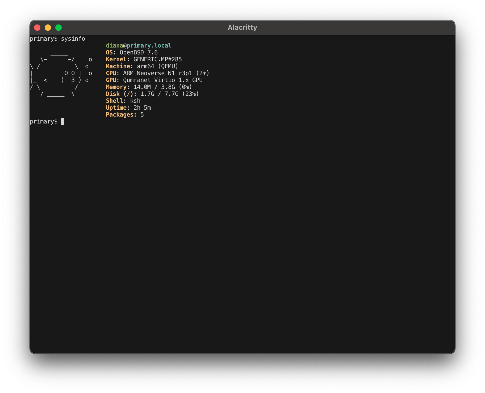

# sysinfo

Display OpenBSD system information.



## Features

- System information display with Puffy ASCII art
- Hardware detection including virtualization environment
- Memory and disk usage with scaled units
- Window manager detection for X11 and Wayland
- Color output with ANSI terminal support

## Installation

```sh
# Clone the repository
git clone https://github.com/telesvar/sysinfo.git
# or with got
got clone https://github.com/telesvar/sysinfo.git
got checkout sysinfo.git/ sysinfo/

cd sysinfo
doas make install
```

## Usage

Display system information:
```sh
sysinfo
```

Options:
```sh
sysinfo [-Chnv]
    -C          disable color output
    -h          display help
    -n          disable ASCII art
    -v          display version
```

Color output can also be disabled by setting the NO_COLOR environment variable.

## Uninstallation

```sh
doas make uninstall
```

## License

MIT License.  See [LICENSE](LICENSE) file for details.

## Authors

- Original work by [Szenesis](https://github.com/Szenesis/sysinfo)
- Modified by Dair Aidarkhanov
